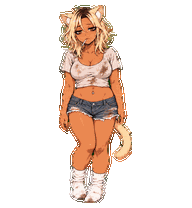
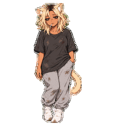

# Codex pets

Four original custom companions, ready to copy between computers.

**Mild9 Neko** combines Mild6's pale blonde hair and motion references with a dirty white crop top, frayed shorts, grubby socks, and a cigarette-drag idle. Her expressions lean further into slovenly smoker comedy.



[Download Mild9 ZIP](mild9-neko/final/mild9-neko.zip?raw=true) · [All Mild9 frames](mild9-neko/qa/contact-sheet-extended.png)

| Mild6 Neko | Mild8 Neko | Mimi Moonbyte |
| --- | --- | --- |
|  |  |  |
| The more covered Neko: a stained baggy shirt, full-length joggers, lighter blonde hair and a lighter tan. Same sleepy slob attitude. | A scruffy adult gyaru catgirl with blonde hair, a fake tan, white socks, a navel piercing, and a cigarette habit. | A quirky moon-tech mage inspired by PC98 fantasy and science-fiction JRPGs. |
| [Download ZIP](mild6-neko/final/mild6-neko.zip?raw=true) · [All frames](mild6-neko/qa/contact-sheet-extended.png) | [Download ZIP](mild8-neko/final/mild8-neko.zip?raw=true) · [All frames](mild8-neko/qa/contact-sheet-extended.png) | [Download ZIP](mimi-moonbyte/mimi-moonbyte.zip?raw=true) · [All frames](mimi-moonbyte/qa/contact-sheet-extended.png) |

Each pet has nine standard animation states, sixteen clockwise look directions, and a transparent 1536×2288 v2 spritesheet. All Neko characters retain a cigarette; Mild6 has the more covered clothing.

## Install on another computer

Clone this repository, or download and extract its ZIP from GitHub. The installable packages are under `pets/`; each contains `pet.json` and `spritesheet.webp`.

### Windows / PowerShell

Run from the repository folder:

```powershell
.\install-pets.ps1
```

This copies all pets to `$CODEX_HOME/pets` when `CODEX_HOME` is set, otherwise to `$HOME/.codex/pets`. Existing identical packages are skipped. A different existing package is left untouched unless you explicitly pass `-Force`.

To install only Mild6 Neko for work:

```powershell
.\install-pets.ps1 -Pet mild6-neko
```

The `-Pet` option accepts one or more folder IDs and does not remove already installed pets.

For Mild9 on your personal computer, use `./install-pets.ps1 -Pet mild9-neko`.

To choose a different Codex home:

```powershell
.\install-pets.ps1 -CodexHome 'D:\MyCodexHome'
```

### Manual installation

Copy the desired folders from `pets/` into the `pets` directory inside your Codex home. For the more covered Neko, copy `pets/mild6-neko`. Keep each pet's two files together in its own directory. On a default Windows setup the destination is `%USERPROFILE%\.codex\pets`; on macOS it is `~/.codex/pets`.

Installation only copies the package files; it does not select a pet or change app settings. These paths and package conventions follow the local hatch-pet skill used to build this collection. Live app playback and discovery on another computer have not been verified.

## Validation and source records

The packages passed atlas-format, transparency, independent visual, and blind-majority direction checks. Some intermediate gaze angles are subtle. Motion review uses ordered frame sequences where the review viewer exposes only the first GIF frame; real-time app playback was not tested. Mimi's preview GIFs precede final edge cleanup; its installable WebP contains the cleaned result.

- [`pets/`](pets/): portable, installable packages.
- [`packages.json`](packages.json): package names and SHA-256 hashes.
- [`mild9-neko/`](mild9-neko/), [`mild6-neko/`](mild6-neko/), [`mild8-neko/`](mild8-neko/), [`mimi-moonbyte/`](mimi-moonbyte/): artwork, prompts, source strips, previews, and QA history.
- Historical QA records retain the original machine paths and failed attempts for provenance. Installation uses only the relative files under `pets/`.

Artwork was generated using OpenAI's built-in image generator, then assembled and checked with the hatch-pet workflow. The exact built-in model identifier was not exposed. See each pet's `generation-prompts.md` for the prompt set.

The repository's existing [Apache 2.0 license](LICENSE) is preserved.
